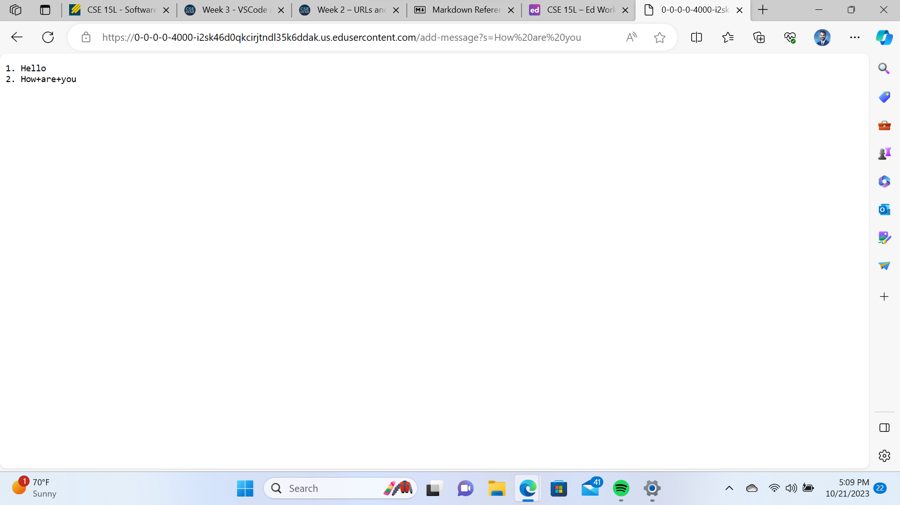

# **Lab Report 1**  

*KEVIN WILLIAM PEOPLES*  
*A17465911*

## Part1
Following is the code for a web server called the StringServer.  
```
import java.io.IOException;
import java.net.URI;

class StringHandler implements URLHandler {
    private StringBuilder messageStorage = new StringBuilder();
    private int messageCounter = 0;

    public String handleRequest(URI url) {
        if (url.getPath().equals("/add-message")) {
            String queryString = url.getQuery();
            String[] parts = queryString.split("=");
            if (parts.length == 2 && parts[0].equals("s")) {
                String message = parts[1];
                messageCounter++;
                messageStorage.append(messageCounter).append(". ").append(message).append("\n");
                return messageStorage.toString();
            }
        }
        return "Invalid request. Use /add-message?s=<message>";
    }
}

class StringServer {
    public static void main(String[] args) throws IOException {
        if (args.length == 0) {
            System.out.println("Missing port number!");
            return;
        }

        int port = Integer.parseInt(args[0]);

        Server.start(port, new StringHandler());
    }
} 
```
1)
    **Method Called**: A GET request to /add-message?s=Hello is made.  
**Relevant Arguments**: The request contains the path and query parameters, with s=Hello.  
**Values Change**: The messageStorage is updated with "1. Hello\n" as the response.  

2)
**Method Called**: A GET request to /add-message?s=How are you is made.  
**Relevant Arguments**: The request contains the path and query parameters, with s=How are you.  
**Values Change**: The messageBuilder is updated to "1. Hello\n2. How are you\n" as the response.

## Part2 
To get both the Private and the Public key, we first have to run the command ** ssh-keygen **  
'ssh-keygen' is a standard component of the Secure Shell and it generates both the private and the public key.  

1) *The path to the private key for your SSH key for logging into ieng6.*
     
**In the above Image 'id_ed2559' is where the private key is located.**
2) *The path to the public key for your SSH key for logging into ieng6.* 
    
**In the above Image 'id_ed2559.pub' is where the public key is located.**
     
3) *A terminal interaction where you log into ieng6 with your course-specific account without being asked for a password.*

## Part 3
Both Week2 and Week3, taught me some new concepts and enhanced my knowledge.  
The second week's subjects were ones I was unaware of. It was entirely new to me and rather interesting to use SSH to connect to a distant server.  
I became familiar with the mkdir command, which lets users create directories, in week three.

